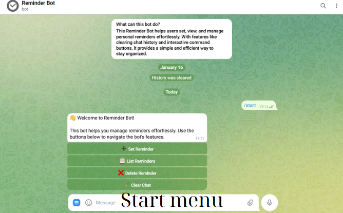
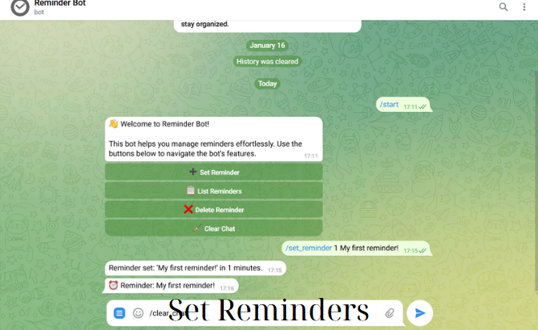
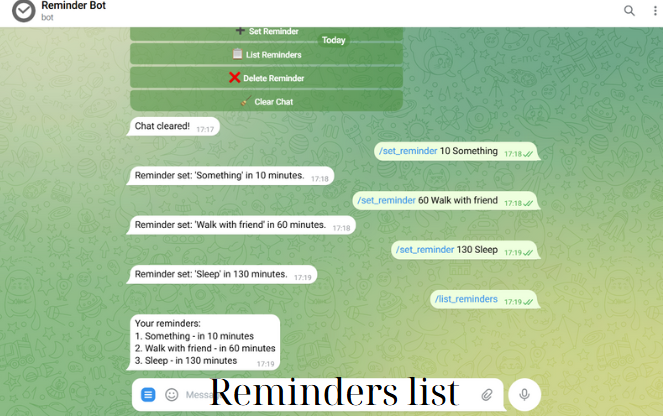
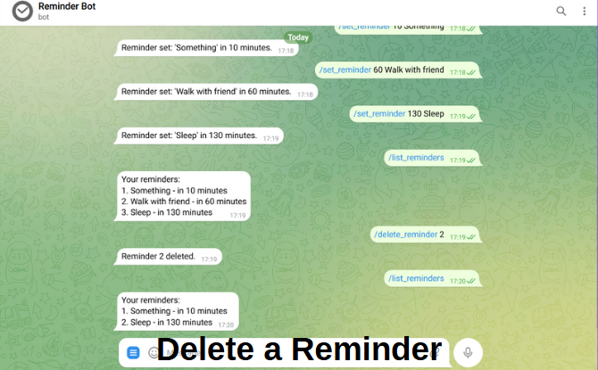
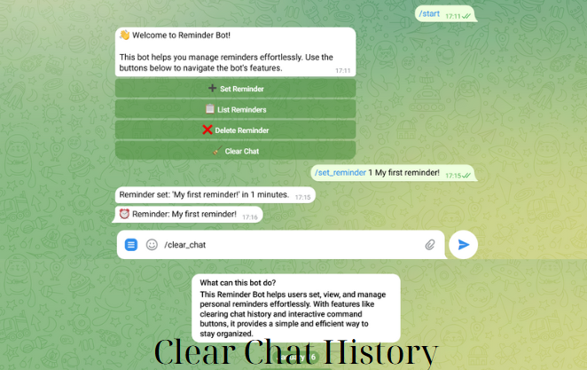
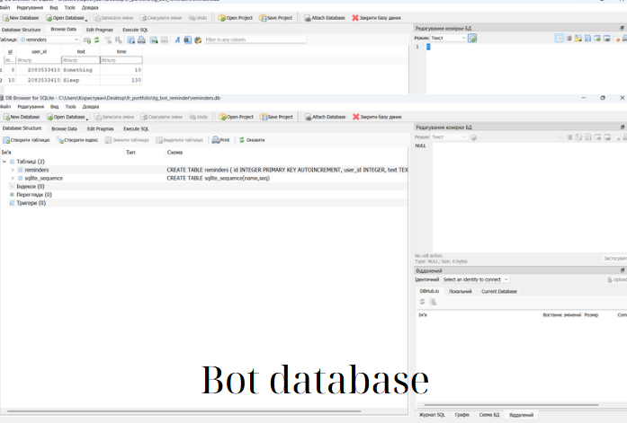

# Reminder Bot
## Project Description: Reminder Bot
The Reminder Bot is a Python-based Telegram bot designed to help users efficiently manage their personal reminders. Built using the Aiogram library for interacting with the Telegram API and SQLite for lightweight database management, this bot offers a simple and intuitive interface for creating, viewing, and managing reminders.

---

## Features
1. #### Set Reminders Command: 
* > /set_reminder \<minutes> \<text>
* Allows users to create reminders by specifying a time interval (in minutes) and a reminder message.
* Sends a notification when the time elapses and automatically deletes the reminder from the database.
2. #### View All Reminders:
* > /list_reminders
* Displays a list of all active reminders for the user in a simple and organized format, showing the reminder text and remaining time.
3. #### Delete a Reminder:
* > /delete_reminder \<index>
* Enables users to delete specific reminders by their index in the displayed list of reminders.
4. #### Clear Chat History:
* > /clear_chat
* Clears all messages from the chat, including messages from both the user and the bot. Useful for maintaining a clean conversation.
5. #### Interactive Menu with Buttons:
* A user-friendly inline keyboard provides quick access to all features, eliminating the need to type commands manually.
* Buttons Include:
    * ➕ Set Reminder
    * 📋 List Reminders
    * ❌ Delete Reminder
    * 🧹 Clear Chat
6. #### Permission Check:
* A helper command verifies whether the bot has the necessary administrative privileges for certain actions (e.g., clearing the chat).
7. #### Main Menu Initialization:
* Upon using /start, users are welcomed with a description of the bot and an inline menu for navigating its features.

---

## Demo screens

---

## Implementation Details
1. #### Database Management:
* SQLite is used to store reminders persistently.
* The database includes a table reminders with fields for user ID, reminder text, and time interval.
2. #### Async Operations:
* Built with asyncio to handle long-running tasks, such as waiting for the reminder interval to elapse, without blocking the bot’s operation.
3. #### Error Handling:
* Robust error handling ensures a smooth user experience by managing invalid inputs, missing permissions, and other potential issues gracefully.
4. #### Custom Bot Commands:
* The bot’s commands are pre-configured in the Telegram interface for ease of use. Users can access them via the command menu in the Telegram app.

---

## How It Works
1. #### Setting a Reminder:
* Users type the 
> /set_reminder 

command followed by the time in minutes and the reminder  text.
* The bot saves the reminder to the database and waits for the specified time to elapse.
* After the time elapses, the bot sends the reminder to the user and deletes it from the database.
2. #### Listing Reminders:
* The bot queries the database for the user's active reminders and displays them in a numbered list.
3. #### Deleting a Reminder:
* Users specify the index of the reminder they want to delete. 
* The bot finds the corresponding database record and removes it.
4. #### Clearing the Chat:
* The bot deletes all messages in the chat, provided it has the necessary administrative permissions.
5. #### Interactive Menu:
* Users can navigate the bot’s features with an intuitive inline keyboard that provides buttons for quick actions.

---

## Bot Commands
Command | Description 
:-------| -----------:
/start |Start the bot and show the menu.
/set_reminder \<minutes> \<text> | Set a new reminder.
/list_reminders | View all active reminders.
/delete_reminder \<index> | Delete a specific reminder.
/clear_chat | Clear chat history.

---

## Inline Buttons

#### Quick access to bot features with an intuitive inline keyboard:
* ➕ Set Reminder
* 📋 List Reminders
* ❌ Delete Reminder
* 🧹 Clear Chat

---

#### Conclusion

The Reminder Bot is a practical and user-friendly tool that combines Python, databases, and APIs to provide a lightweight and scalable reminder management system. It is easy to extend with additional features in the future and is perfect for daily use. The bot’s ability to work asynchronously and manage reminders efficiently makes it an excellent utility for Telegram users.

---

[Reminder Bot](https://t.me/reminder67_bot)